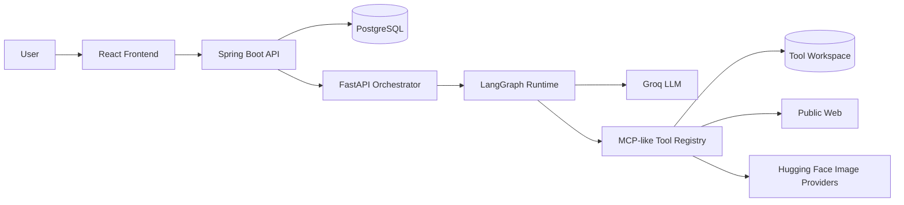
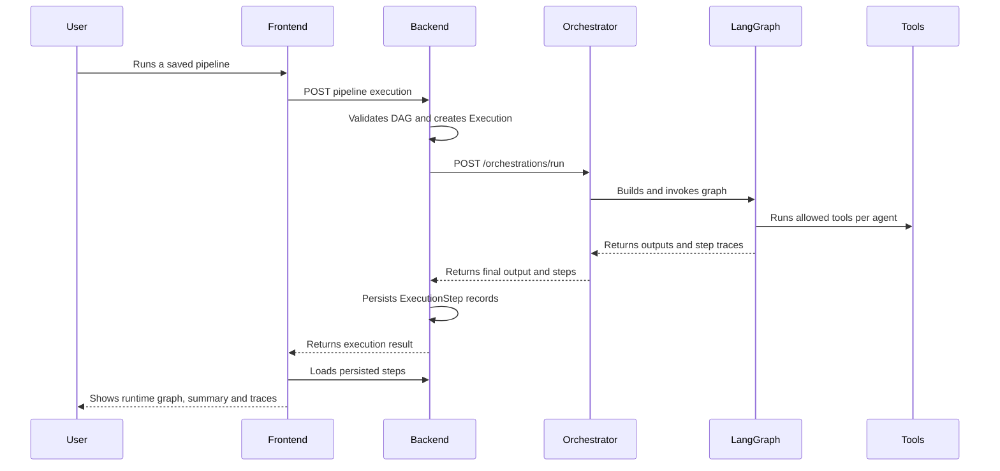
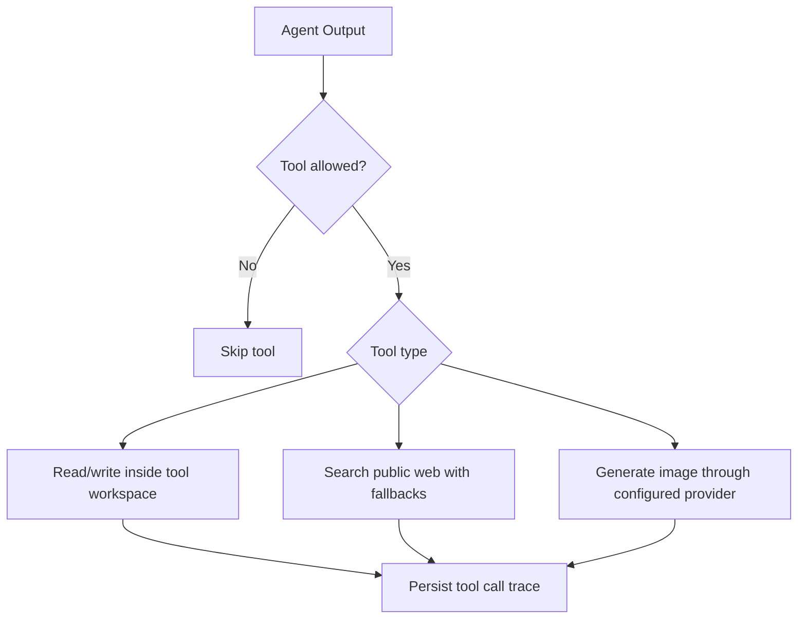

# AgentFlow Studio

AgentFlow Studio is a local study project for building a visual multi-agent orchestration platform. It combines a Spring Boot backend, a FastAPI orchestrator, a React/Vite frontend, PostgreSQL, LangGraph, controlled MCP-like tools, an internal A2A-like message contract, and Groq.

## Current Status

The V1 scope is implemented and the project is now in post-V1 hardening:

- Project, agent, pipeline and execution APIs.
- Visual Studio for graph editing with React Flow.
- Playground for running pipelines and inspecting summaries, traces, tool calls, generated images and generated files.
- Backend pipeline validation for V1 DAG rules.
- Execution step persistence.
- LangGraph-based orchestration.
- Groq adapter with fallback behavior for local development.
- Controlled tools per agent through `allowedTools`.

## Architecture



## Execution Flow



## Repository Layout

```txt
backend/
  src/main/java/com/thalys/agentflow/
    controller/
    service/
    repository/
    domain/
    dto/
    client/
    config/
frontend/
  src/
    api/
    components/
    constants/
    flows/
    pages/
orchestrator/
  app/
    a2a/
    graph/
    llm/
    mcp/
    schemas/
    services/
```

## Controlled Tools

Agents can only run tools explicitly enabled in `allowedTools`:

- `word_count`
- `echo_context`
- `file_write`
- `file_read`
- `web_search`
- `image_generate`

File tools are scoped to `AGENTFLOW_TOOL_WORKDIR`. The platform can preview files generated by `file_write`, format the preview by extension and open generated HTML files in a new tab. The product does not include demo-specific code execution or demo-specific proxies.

Structured tool input can be sent as JSON:

```json
{
  "file_write": {
    "path": "notes/example.md",
    "content": "# Hello",
    "overwrite": true
  },
  "file_read": {
    "path": "notes/example.md"
  },
  "web_search": {
    "query": "LangGraph StateGraph examples",
    "maxResults": 3
  },
  "image_generate": {
    "prompt": "A clean product mockup on a white desk",
    "path": "images/mockup.png"
  }
}
```

## Design Boundaries



Important boundaries:

- No real secrets in Git.
- No unrestricted filesystem access.
- No arbitrary code execution as a platform feature.
- No demo-specific routes, ports, proxies or generated-project assumptions in product code.
- Pipeline validation stays in the backend before execution.

## Local Development

Backend:

```bash
cd backend
./mvnw test
```

Orchestrator:

```bash
cd orchestrator
python -m pytest
```

Frontend:

```bash
cd frontend
npm run build
```

Full stack:

```bash
docker compose up --build
```

Local URLs:

- Frontend: `http://localhost:5173`
- Backend health: `http://localhost:8080/api/health`
- Orchestrator health: `http://localhost:8000/health`

## Environment

Use `.env.example` as a safe template and place real values in `.env`, which is ignored by Git.

Key variables:

```env
GROQ_API_KEY=replace-me
GROQ_MODEL=meta-llama/llama-4-scout-17b-16e-instruct
AGENTFLOW_HOST_TOOL_WORKDIR=./tool-workspace
ORCHESTRATOR_PUBLIC_BASE_URL=http://localhost:8000
ORCHESTRATOR_CORS_ORIGINS=http://localhost:5173,http://127.0.0.1:5173
VITE_API_BASE_URL=http://localhost:8080
```

## Refactor Direction

- Backend: keep controllers thin, domain rules in services, and graph validation in dedicated components.
- Frontend: keep pages as orchestration shells and move reusable formatting/runtime helpers into feature modules.
- Orchestrator: keep tool handlers small and split parsing, formatting, providers and graph execution helpers when they grow.
- Tests: preserve unit tests for backend/orchestrator and add UI/component tests as the frontend grows.
